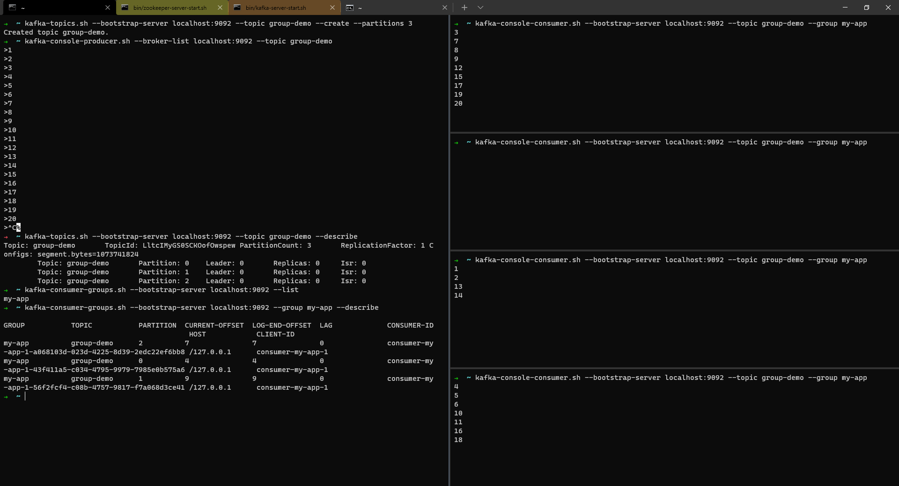

# Apache Kafka - CLI - Hands-on

Uma sessão inicial de exemplo de uso do CLI do Apache Kafka.

Pré-requisitos:

- Apache Kafka instalado e funcional, com Zookeeper.

Todos os comandos utilizados estão localizados no diretório `bin` da instalação padrão do Kafka. Nos exemplos estaremos logados na máquina servidora, de forma que o servidor/broker se encontra em `localhost:9092` (altere para refletir a sua instalação).

## Tópicos

Utilizamos `kafka-topics.sh` para manipular os tópicos.

- `--bootstrap-server <endereco-servidor>:9092` indica o servidor no qual será executado o comando.
- `--list` 
- `--topic <nome-do-topico>` indica o nome/identificador do tópico.
  - `--create` cria o tópico.
    - `--partitions N` opcionalmente indica o uso de `N` partições.
    - `--replication-factor N` opcionalmente indica o uso de fator de replicação `N` (<= ao número de brokers).
  - `--describe` traz informações sobre o tópico.
  - `--delete` exclui o tópico.

Liste os tópicos:

```zsh
➜  ~ kafka-topics.sh --bootstrap-server localhost:9092 --list
__consumer_offsets
```

💡 _Perceba que o único tópico existente é `__consumer_offsets`. Ele sempre existirá, pois faz parte da infraestrutura do próprio Kafka._

Criando tópicos:

- `t1`, com 1 partição e fator de replicação 1.
- `t2`, com 3 partições e fator de replicação 1.

```zsh
➜  ~ kafka-topics.sh --bootstrap-server localhost:9092 --list
__consumer_offsets
➜  ~ kafka-topics.sh --bootstrap-server localhost:9092 --topic t1 --create --partitions 1
Created topic t1.
➜  ~ kafka-topics.sh --bootstrap-server localhost:9092 --topic t2 --create --partitions 3
Created topic t2.
➜  ~ kafka-topics.sh --bootstrap-server localhost:9092 --list
__consumer_offsets
t1
t2
➜  ~
```

Descrevendo-os:

```zsh
➜  ~ kafka-topics.sh --bootstrap-server localhost:9092 --topic t1 --describe
Topic: t1       TopicId: dnUucN9RSyS8kuFZRCH9Zg PartitionCount: 1       ReplicationFactor: 1    Configs: segment.bytes=1073741824
        Topic: t1       Partition: 0    Leader: 0       Replicas: 0     Isr: 0
➜  ~ kafka-topics.sh --bootstrap-server localhost:9092 --topic t2 --describe
Topic: t2       TopicId: hxYZkiVkRX24U5hLbHfjog PartitionCount: 3       ReplicationFactor: 1    Configs: segment.bytes=1073741824
        Topic: t2       Partition: 0    Leader: 0       Replicas: 0     Isr: 0
        Topic: t2       Partition: 1    Leader: 0       Replicas: 0     Isr: 0
        Topic: t2       Partition: 2    Leader: 0       Replicas: 0     Isr: 0
➜  ~
```

Excluindo:

```zsh
➜  ~ kafka-topics.sh --bootstrap-server localhost:9092 --topic t3 --create
Created topic t3.
➜  ~ kafka-topics.sh --bootstrap-server localhost:9092 --list
__consumer_offsets
t1
t2
t3
➜  ~ kafka-topics.sh --bootstrap-server localhost:9092 --topic t3 --delete
➜  ~ kafka-topics.sh --bootstrap-server localhost:9092 --list
__consumer_offsets
t1
t2
➜  ~
```

## Produtores

Produzimos mensagens usando `kafka-console-producer.sh`. Cada linha enviada será uma mensagem. Finalize com `^C`.

- `--broker-list <endereco-servidor>:9092` indica uma lista (separada por `,`) dos servidores.
- `--topic <nome-do-topico>` indica o nome/identificador do tópico.
- `--producer-property acks=all` aguarda confirmação total da gravação.

💡 _Caso o tópico não exista, será criado com as configurações padrão. _Não é recomendado_._

```zsh
➜  ~ kafka-console-producer.sh --broker-list localhost:9092 --topic t1
>Hello, t1!
>This is a message from planet Earth.
>Please don t eat us.
>Bye
>^C%
➜  ~ kafka-console-producer.sh --broker-list localhost:9092 --topic t2 --producer-property acks=all
>Hello, t2!
>If you are hungry, talk to t1!
>We re not tasty enough.
>And we fight back.
>... eventually.
>;)
>^C
➜  ~
```

## Consumidores

Criamos processos consumidores usando `kafka-console-consumer.sh`. Finalize com `^C`.

- `--bootstrap-server <endereco-servidor>:9092` indica o servidor do qual será consumido.
- `--topic <nome-do-topico>` indica o nome/identificador do tópico.
- `--from-beggining` consome todo o tópico, desde o início (e não somente as novas mensagens).
- `--group <nome-do-grupo>` define um grupo de consumidores.

```zsh
➜  ~ kafka-console-consumer.sh --bootstrap-server localhost:9092 --topic t1
^CProcessed a total of 0 messages
➜  ~ kafka-console-consumer.sh --bootstrap-server localhost:9092 --topic t1 --from-beginning
Hello, t1!
This is a message from planet Earth.
Please don t eat us.
Bye
^CProcessed a total of 4 messages
➜  ~ kafka-console-consumer.sh --bootstrap-server localhost:9092 --topic t2
^CProcessed a total of 0 messages
➜  ~ kafka-console-consumer.sh --bootstrap-server localhost:9092 --topic t2 --from-beginning
And we fight back.
;)
If you are hungry, talk to t1!
... eventually.
Hello, t2!
We re not tasty enough.
^CProcessed a total of 6 messages
➜  ~
```

## Grupos de consumidores

Para criar clusters de consumidores, defina grupos. O Kafka fará o balanceamento entra todos os consumidores do mesmo grupo, que compartilharão o _offset_ e nunca receberão a mesma mensagem.

Exemplo com grupo de consumidores:

```zsh
➜  ~ kafka-console-consumer.sh --bootstrap-server localhost:9092 --topic group-demo --group my-app
```

💡 _O número de consumidores ativos é limitado pelo número de partições._

Para listar os grupos, use `kafka-consumer-groups.sh`.

Exemplo:
```
➜  ~ kafka-consumer-groups.sh --bootstrap-server localhost:9092 --list
my-app
➜  ~
```

Podemos também obter a descrição do estado de um grupo.

```zsh
➜  ~ kafka-consumer-groups.sh --bootstrap-server localhost:9092 --group my-app --describe

GROUP           TOPIC           PARTITION  CURRENT-OFFSET  LOG-END-OFFSET  LAG             CONSUMER-ID                                            HOST            CLIENT-ID
my-app          group-demo      2          7               7               0               consumer-my-app-1-a068103d-023d-4225-8d39-2edc22ef6bb8 /127.0.0.1      consumer-my-app-1
my-app          group-demo      0          4               4               0               consumer-my-app-1-43f411a5-c034-4795-9979-7985e0b575a6 /127.0.0.1      consumer-my-app-1
my-app          group-demo      1          9               9               0               consumer-my-app-1-56f2fcf4-c08b-4757-9817-f7a068d3ce41 /127.0.0.1      consumer-my-app-1
➜  ~
```

