# Kafka Connect JDBC - ETL com MySQL e SQLServer

Faremos uma prova de conceito _hands-on_ de integração de bases de dados usando:

- Docker;
- Apache Kafka;
- Kafka Connect;
- Kafka Connect JDBC Connector;
- MySQL;
- MS SQL Server.

O objetivo é criar uma integração em tempo real entre bases MySQL e SQL Server. Vamos usar o Apache Kafka e o Kafka Connect para isso. Serão configurados conectores de origem e destino usando ambas as bases.

⚠ Este material não se destina à publicação em produção. Nenhuma configuração de segurança e disponibilidade foi implementada, e podem haver componentes que necessitam de licenciamento adequado. Também há vários itens desnecessários incluídos como exemplos de uso.

## Ambiente

Pré-requisitos:

- WSL2 (em caso de Windows);
- Docker;

Vamos usar o Docker Compose para iniciar nossa infraestrutura. Criaremos serviço usando as seguintes imagens:

- `lensesio/fast-data-dev`, contendo uma instalação _community_ bastante completa de Apache Kafka, incluindo o Kafka Connect e ferramentas de gestão;
- `mysql`, para nosso servidor MySQL;
- `mcr.microsoft.com/mssql/server`, para nosso servidor SQL Server.

Tudo estará em um único cluster, compartilhando uma mesma rede. Desta forma nenhuma configuração será necessária para as comunicações internas. Serão publicadas as portas para acesso externo, sendo as mais importantes para nosso exemplo as seguinte:

- Porta `3030` - Interface gráfica de gerenciamento;
- Porta `3307` - MySQL;
- Porta `1434` - SQL Server.

Arquivo compose ([`docker-compose.yml`](kafka-connect-jdbc-etl-com-mysql-e-sqlserver/docker-compose.yml)):

```yaml
services:
  kafka-cluster:
    image: lensesio/fast-data-dev
    environment:
      ADV_HOST: 127.0.0.1
    ports:
      - 2181:2181 # ZooKeeper
      - 9092:9092 # Kafka Broker
      - 8081-8083:8081-8083 # REST Proxy, Schema Registry, Kafka Connect
      - 9581-9585:9581-9585 # JMX Ports
      - 3030:3030 # UI, acessível externamente em http://127.0.0.1:3030/
  mysql:
    image: mysql
    command: --default-authentication-plugin=mysql_native_password
    environment:
      MYSQL_ROOT_PASSWORD: root
    ports:
      - 3307:3306 # MySQL, exposto na porta 3307
  sqlserver:
    image: mcr.microsoft.com/mssql/server
    environment:
      SA_PASSWORD: "My_secret_!2#4%"
      ACCEPT_EULA: "Y"
    ports:
      - 1434:1433 # SQL Server, exposto na porta 1434
```

Inicie os serviços usando:

```bash
docker compose up
```

Você verá algo como:

```
[+] Running 4/4
 - Network kafka-connect-jdbc-etl-com-mysql-e-sqlserver_default            Created                                 0.0s
 - Container kafka-connect-jdbc-etl-com-mysql-e-sqlserver_kafka-cluster_1  Created                                 0.2s
 - Container kafka-connect-jdbc-etl-com-mysql-e-sqlserver_sqlserver_1      Created                                 0.1s
 - Container kafka-connect-jdbc-etl-com-mysql-e-sqlserver_mysql_1          Created                                 0.2s
Attaching to kafka-cluster_1, mysql_1, sqlserver_1
sqlserver_1      | SQL Server 2019 will run as non-root by default.
...
mysql_1          | 2021-06-22 12:34:35+00:00 [Note] [Entrypoint]: Initializing database files
...
kafka-cluster_1  | Starting services.
kafka-cluster_1  | This is Lenses.io’s fast-data-dev. Kafka 2.6.2-L0 (Lenses.io's Kafka Distribution).
kafka-cluster_1  | You may visit http://127.0.0.1:3030 in about a minute.
...
```

Durante alguns minutos tudo será iniciado. O terminal ficará aberto, exibindo os logs integrados dos três serviços. Mantenha este terminal aberto. Finalizá-lo (por exemplo, usando `CTRL+C`) encerrará o cluster.

Se for necessário inspecionar algum serviço, recupere o _id_ do _container_ usando `docker ps` e abra um terminal usando:

```bash
docker exec -it <id-do-container> bash
```

Acesse a interface de gerenciamento em `http://127.0.0.1:3030`. Ela permite visualizar o estado do cluster. Quando estiver totalmente carregada (pode demorar alguns minutos) você algo como:

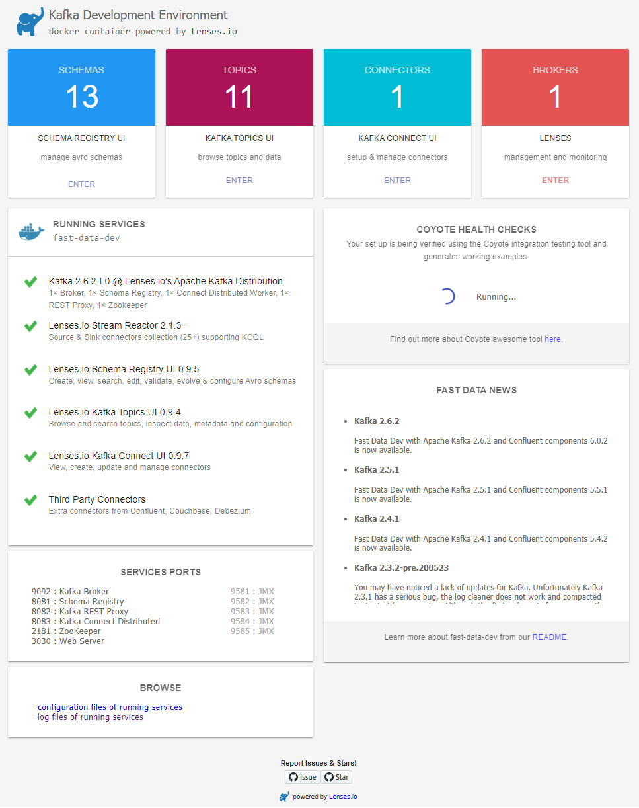

### Bases de dados

Acesse o servidor MySQL em `localhost:3307` (usuário `root`, senha `root`) e crie um banco de dados com a [seguinte estrutura](kafka-connect-jdbc-etl-com-mysql-e-sqlserver/mysql-ddl.sql):

```sql
create database teste_kafka;
use teste_kafka;

create table origem (
	id int auto_increment primary key,
	data varchar(50)
);

create table destino1 (
	id int primary key,
	data varchar(50)
);

create table destino2 (
	id int primary key,
	data varchar(50)
);
```

Faça o mesmo com o SQL Server em `localhost,1434` (usuário `sa`, senha `My_secret_!2#4%`), usando o [script](kafka-connect-jdbc-etl-com-mysql-e-sqlserver/sqlserver-ddl.sql):

```sql
create database teste_kafka;
GO

use teste_kafka;

create table origem (
	id int identity primary key,
	data varchar(50)
);

create table destino1 (
	id int primary key,
	data varchar(50)
);

create table destino2 (
	id int primary key,
	data varchar(50)
);
```

Você deverá ter um banco chamado `teste_kafka` com as tabelas `origem`, `destino1` e `destino2`, em cada um dos servidores. Todas as tabelas iniciarão este exemplo vazias.

## Pipeline de dados

No primeiro exemplo, os dados incluídos em uma tabela no MySQL serão replicados em outra na mesma base, e em uma no SQL Server.

- **Conector 1a**: 🛢 MySQL -> 🔌 Kafka:
  - Origem: MySQL, `teste_kafka.origem`
  - Tópico: Kafka, `etl01-mysql-origem`

- **Conector 1b**: 🔌 Kafka -> 🛢 MySQL:
  - Tópico: Kafka, `etl01-mysql-origem`
  - Destino: MySQL, `teste_kafka.destino1`

- **Conector 1c**: 🔌 Kafka -> 🗃 SQL Server:
  - Tópico: Kafka, `etl01-mysql-origem`
  - Destino: SQL Server, `teste_kafka.dbo.destino1`

No segundo exemplo, o inverso, os dados incluídos em uma tabela no SQL Server serão replicados em outra na mesma base, e em uma no MySQL.

- **Conector 2a**: 🗃 SQL Server -> 🔌 Kafka:
  - Origem: SQL Server, `teste_kafka.dbo.origem`
  - Tópico: Kafka, `etl02-sqlserver-origem`

- **Conector 2b**: 🔌 Kafka -> 🗃 SQL Server:
  - Tópico: Kafka, `etl02-sqlserver-origem`
  - Destino: SQL Server, `teste_kafka.dbo.destino2`

- **Conector 2c**: 🔌 Kafka -> 🛢 MySQL:
  - Tópico: Kafka, `etl02-sqlserver-origem`
  - Destino: MySQL, `teste_kafka.destino2`

## Criando o **Conector 1**

Acesse a interface de gestão do Kafka Connect.

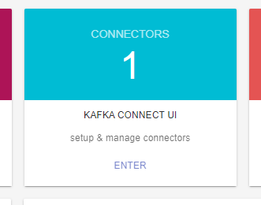

Crie um novo conector:


Selecione um conector _Source_ do tipo JDBC:

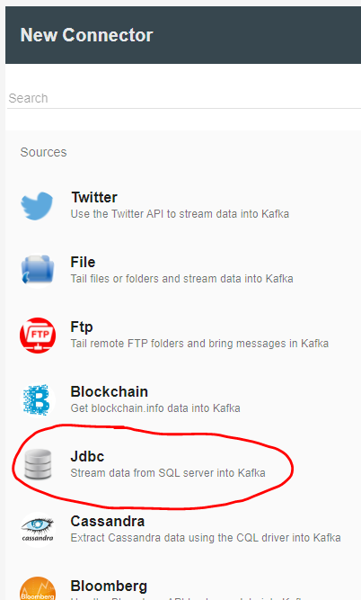

Você verá um campo para escrever um conjunto de chaves e valores.

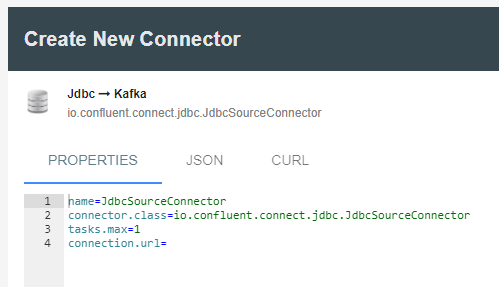

Use as seguintes propriedades e clique em `CREATE`:

[Conector 1a](kafka-connect-jdbc-etl-com-mysql-e-sqlserver/ETL01-MySQLJdbcSourceConnector.properties)
```ini
name=ETL01-MySQLJdbcSourceConnector
connector.class=io.confluent.connect.jdbc.JdbcSourceConnector
connection.url=jdbc:mysql://mysql:3306/
connection.user=root
connection.password=root
mode=incrementing
table.whitelist=teste_kafka.origem
topic.prefix=etl01-mysql-
tasks.max=1
```

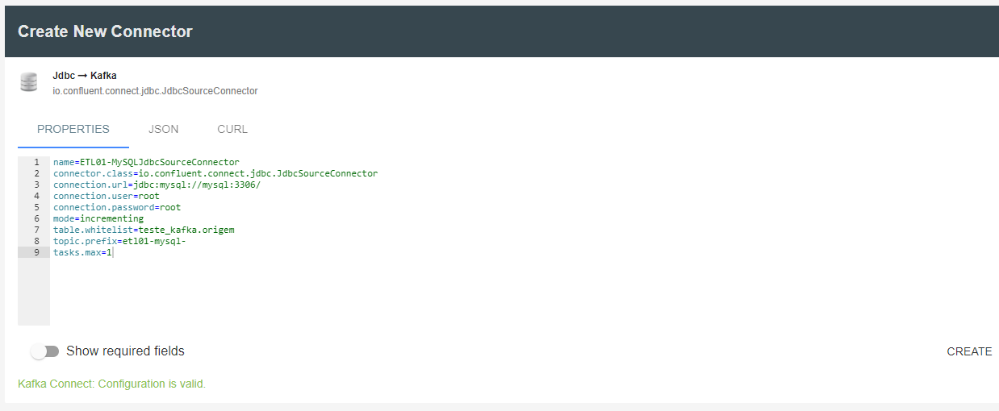

Você verá que o novo conector foi criado e a topologia de conectores alterada.

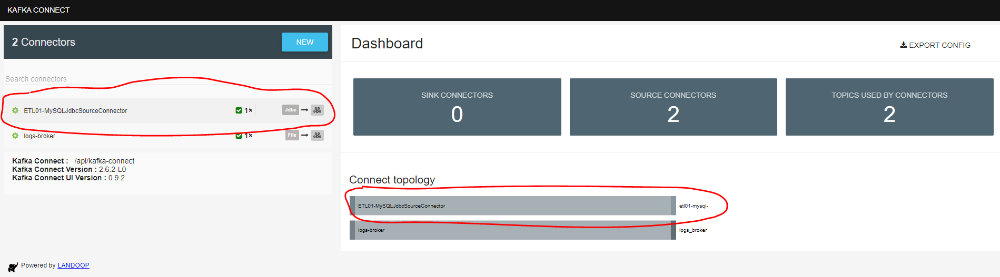

A partir de agora todos os registros em `teste_kafka.origem` do MySQL serão monitorados. Novos registros serão detectados através do incremento na chave-primária, devido à configuração `mode=incrementing`. As alterações serão publicadas no tópico `etl01-mysql-origem`, no formato Apache Avro (resumidamente, JSON com esquema).

Crie um novo conector _Sink_ do tipo JDBC:

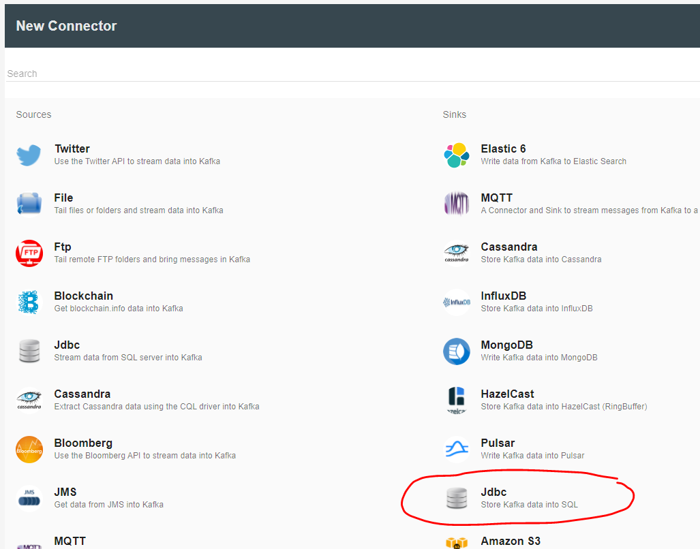

[Conector 1b](kafka-connect-jdbc-etl-com-mysql-e-sqlserver/ETL01-MySQLJdbcSinkConnector.properties)
```ini
name=ETL01-MySQLJdbcSinkConnector
connector.class=io.confluent.connect.jdbc.JdbcSinkConnector
topics=etl01-mysql-origem
connection.url=jdbc:mysql://mysql:3306/
connection.password=root
connection.user=root
table.name.format=teste_kafka.destino1
tasks.max=1
```

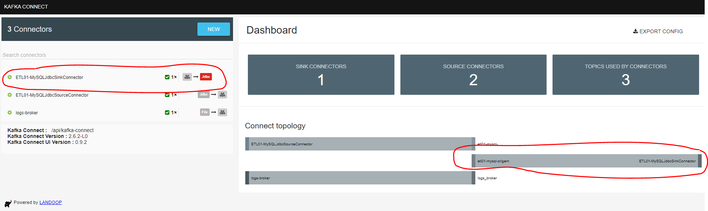

A partir de agora as alterações no tópico `etl01-mysql-origem` serão consumidas e inseridas na tabela `teste_kafka.destino1` do MySQL.

Vamos agora criar um segundo consumidor, que salvará os mesmos dados também no SQL server. Crie um novo conector _Sink_ do tipo JDBC com a seguinte configuração:

[Conector 1c](kafka-connect-jdbc-etl-com-mysql-e-sqlserver/ETL01-SQLServerJdbcSinkConnector.properties)
```ini
name=ETL01-SQLServerJdbcSinkConnector
connector.class=io.confluent.connect.jdbc.JdbcSinkConnector
topics=etl01-mysql-origem
connection.url=jdbc:sqlserver://sqlserver:1433
connection.password=My_secret_!2#4%
connection.user=sa
table.name.format=teste_kafka.dbo.destino1
tasks.max=1
```

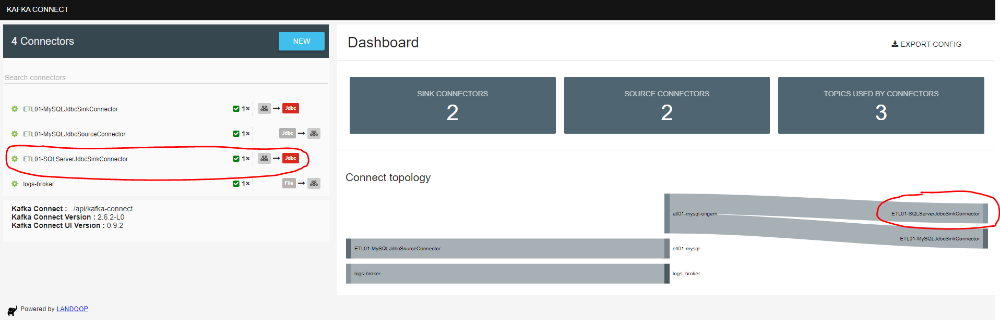

A partir de agora as alterações no tópico `etl01-mysql-origem` serão consumidas e inseridas na tabela `teste_kafka.dbo.destino1` do SQL Server. Note que teremos dois destinos em servidores e tecnologias diferentes, a partir da mesma origem.

## Criando o **Conector 2**

Agora vamos inverter o processo, sendo o SQL Server a origem e o MySQL o segundo destino. Repita o processo anterior usando as seguintes propriedades:

[Conector 2a](kafka-connect-jdbc-etl-com-mysql-e-sqlserver/ETL02-SQLServerJdbcSourceConnector.properties)
```ini
name=ETL02-SQLServerJdbcSourceConnector
connector.class=io.confluent.connect.jdbc.JdbcSourceConnector
connection.url=jdbc:sqlserver://sqlserver:1433
connection.user=sa
connection.password=My_secret_!2#4%
mode=incrementing
catalog.pattern=teste_kafka
schema.pattern=dbo
table.whitelist=origem
topic.prefix=etl02-sqlserver-
tasks.max=1
```

[Conector 2b](kafka-connect-jdbc-etl-com-mysql-e-sqlserver/ETL02-SQLServerJdbcSinkConnector.properties)
```ini
name=ETL02-SQLServerJdbcSinkConnector
connector.class=io.confluent.connect.jdbc.JdbcSinkConnector
topics=etl02-sqlserver-origem
connection.url=jdbc:sqlserver://sqlserver:1433
connection.user=sa
connection.password=My_secret_!2#4%
table.name.format=teste_kafka.dbo.destino2
tasks.max=1
```

[Conector 2c](kafka-connect-jdbc-etl-com-mysql-e-sqlserver/ETL02-MySQLJdbcSinkConnector.properties)
```ini
name=ETL02-MySQLJdbcSinkConnector
connector.class=io.confluent.connect.jdbc.JdbcSinkConnector
topics=etl02-sqlserver-origem
connection.url=jdbc:mysql://mysql:3306/
connection.user=root
connection.password=root
table.name.format=teste_kafka.destino2
tasks.max=1
```

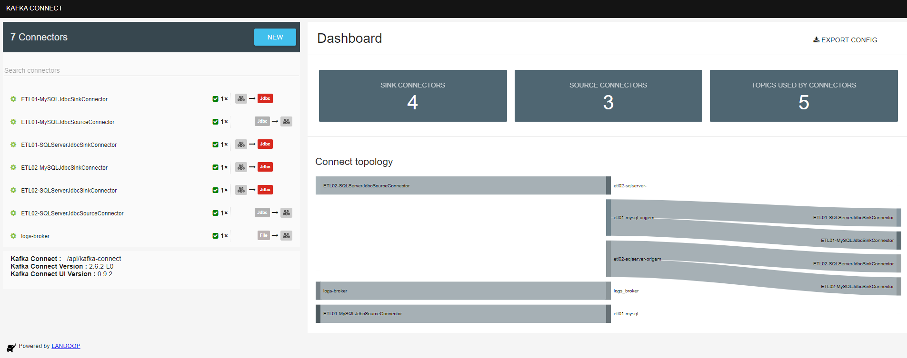

Agora as alterações em `teste_kafka.dbo.origem` (no SQL Server) refletirão em `teste_kafka.dbo.destino1` (no SQL Server) e em `teste_kafka.destino2` (no MySQL).

## Demonstração

[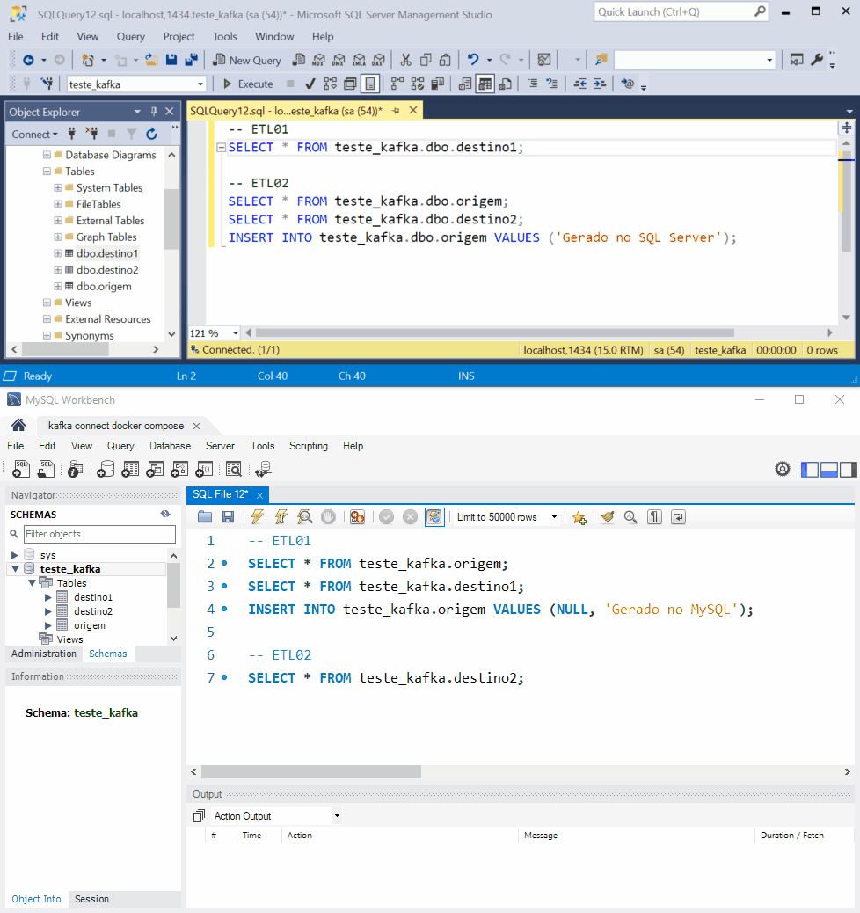](kafka-connect-jdbc-etl-com-mysql-e-sqlserver/demo.mp4)
